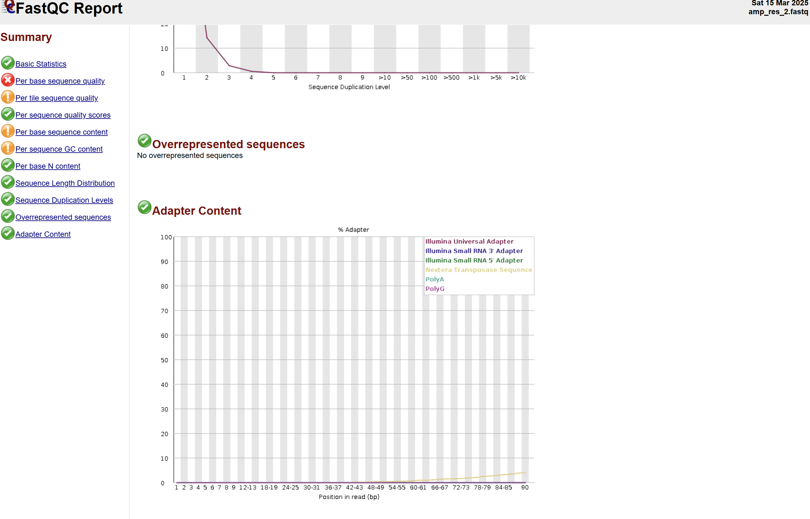

# Install data
## Reference
	first of all install reference from here:
	https://ftp.ncbi.nlm.nih.gov/genomes/all/GCF/000/005/845/GCF_000005845.2_ASM584v2/
	
```Bash
wget https://ftp.ncbi.nlm.nih.gov/genomes/all/GCF/000/005/845/GCF_000005845.2_ASM584v2/GCF_000005845.2_ASM584v2_genomic.fna.gz

wget https://ftp.ncbi.nlm.nih.gov/genomes/all/GCF/000/005/845/GCF_000005845.2_ASM584v2/GCF_000005845.2_ASM584v2_genomic.gff.gz

```

**so we have .gff and .fna files**

now install shotgun sequences https://figshare.com/articles/dataset/amp_res_2_fastq_zip/10006541/3


```Bash
unzip 1000495.zip
```

```
10006541.zip  amp_res_1.fastq  amp_res_2.fastq
(base) mhprs@Seraph:~/PISH/Genomics/project_2_antibiotic/data/raw/shotgun_seq$ head -10 amp_res_1.fastq
@SRR1363257.37 GWZHISEQ01:153:C1W31ACXX:5:1101:14027:2198 length=101
GGTTGCAGATTCGCAGTGTCGCTGTTCCAGCGCATCACATCTTTGATGTTCACGCCGTGGCGTTTAGCAATGCTTGAAAGCGAATCGCCTTTGCCCACACG
+
@?:=:;DBFADH;CAECEE@@E:FFHGAE4?C?DE<BFGEC>?>FHE4BFFIIFHIBABEECA83;>>@>@CCCDC9@@CC08<@?@BB@9:CC#######
@SRR1363257.46 GWZHISEQ01:153:C1W31ACXX:5:1101:19721:2155 length=101
GTATGAGGTTTTGCTGCATTCTCTGNGCGAATATTAACTCCNTNNNNNTTATAGTTCAAAGCAAGTACCTGTCTCTTATACACATCTCCGAGCCCACGAGC
+
```

#IMP 

Commands to use
	head -20 [filename.format]  # View the first 20 lines of the file  
	cat [filename.fasta]  # Display the entire fasta file  
	wc -l [filename.fastq]  # Count the number of lines in the FASTQ file  
	conda install -c bioconda seqkit  # Install seqkit via conda  
	seqkit stats [filename.fastq.gz]  # Get detailed statistics about the FASTQ file  

stat of seq
```Bash
 awk '{n++} END {print n/4}' amp_res_1.fastq
455876
```

```Bash
(GP_data) mhprs@Seraph:~/PISH/Genomics/project_2_antibiotic/data/raw/shotgun_seq$ seqkit stats amp_res_1.fastq

file             format  type  num_seqs     sum_len  min_len  avg_len  max_len
amp_res_1.fastq  FASTQ   DNA    455,876  46,043,476      101      101      101

```

# **Inspect raw sequencing data with FastQC. Filtering the reads.**

FastQC v0.12.1

for amp_res_1_fastqc.html 

| Measure                           | Value                   |
| --------------------------------- | ----------------------- |
| Filename                          | amp_res_1.fastq         |
| File type                         | Conventional base calls |
| Encoding                          | Sanger / Illumina 1.9   |
| Total Sequences                   | 455876                  |
| Total Bases                       | 46 Mbp                  |
| Sequences flagged as poor quality | 0                       |
| Sequence length                   | 101                     |
| %GC                               | 50                      |


basic statistics matches with calculated before

but here we have red flag in "per sequence quality" for reverse reads


and "per sequence quality" & "Per tile sequence quality" for forward reads


also in both files we have Nextera transposase sequence


let's find where we can get Nextera transposase sequence .fa
```Bash
find $(conda info --base)/envs/GP_data/share/trimmomatic/ -name "NexteraPE-PE.fa"

/home/mhprs/miniconda3/envs/GP_data/share/trimmomatic/adapters/NexteraPE-PE.fa

```

- **Per Sequence Quality (reverse reads)** – The average quality of individual reads is too low, indicating potential sequencing errors.
- **Per Sequence Quality (forward reads)** – The same issue: read quality is dropping.
- **Per Tile Sequence Quality (forward reads)** – A specific area (tile) on the sequencing chip shows low quality, possibly due to contamination or hardware issues.

#  (Optional, 1 bonus point) Filtering the reads


	we have Sanger / Illumina 1.9 encoding

so phred +33

trimmomatic -version
0.39
## let's run trimmomatic

```Bash
(GP_data) mhprs@Seraph:~/PISH/Genomics/project_2_antibiotic/data$ 
trimmomatic PE -phred33 raw/shotgun_seq/amp_res_1.fastq raw/shotgun_seq/amp_res_2.fastq processed/amp_res_1P.fastq processed/amp_res_1U.fastq processed/amp_res_2P.fastq processed/amp_res_2U.fastq ILLUMINACLIP:/home/mhprs/miniconda3/envs/GP_data/share/trimmomatic/adapters/NexteraPE-PE.fa:2:30:10 SLIDINGWINDOW:4:20 TRAILING:20 MINLEN:36
```
or in more convenient way
```Bash
trimmomatic PE -phred33 \
    raw/shotgun_seq/amp_res_1.fastq \
    raw/shotgun_seq/amp_res_2.fastq \
    processed/amp_res_1P.fastq \
    processed/amp_res_1U.fastq \
    processed/amp_res_2P.fastq \
    processed/amp_res_2U.fastq \
    ILLUMINACLIP:/home/mhprs/miniconda3/envs/GP_data/share/trimmomatic/adapters/NexteraPE-PE.fa:2:30:10 \
    SLIDINGWINDOW:4:20 \
    TRAILING:20 \
    MINLEN:36

```
### Parameters:

- **trimmomatic PE** — Runs Trimmomatic in paired-end mode.
- **-phred33** — Specifies that the quality scores are in Phred+33 format (Sanger / Illumina 1.8+ encoding).

### Input Files:

- **amp_res_1.fastq** — Forward reads input file.
- **amp_res_2.fastq** — Reverse reads input file.

### Output Files:

- **amp_res_1P.fastq** — Trimmed forward reads where both pairs passed filtering.
- **amp_res_1U.fastq** — Forward reads that were removed because their pair was discarded.
- **amp_res_2P.fastq** — Trimmed reverse reads where both pairs passed filtering.
- **amp_res_2U.fastq** — Reverse reads that were removed because their pair was discarded.

### Processing Steps:

- **ILLUMINACLIP:/home/mhprs/miniconda3/envs/GP_data/share/trimmomatic/adapters/NexteraPE-PE.fa:2:30:10**
    
    - Removes adapter sequences using the **NexteraPE-PE.fa** file.
    - `2` — Maximum number of mismatches allowed in the alignment between adapter and read.
    - `30` — The threshold for the palindrome match (higher value = stricter matching).
    - `10` — Simple match threshold for removing adapter contamination.
- **SLIDINGWINDOW:4:20**
    
    - Uses a sliding window of size `4` bases.
    - If the average quality in the window falls below `20`, the read is trimmed.
- **TRAILING:20**
    
    - Removes bases from the end of a read if their quality is below `20`.
- **MINLEN:36**
    
    - Discards reads that are shorter than `36` bases after trimming.

as a result - we have 
```
wc -l amp_res_1P.fastq
1504040 amp_res_1P.fastq

wc -l amp_res_1U.fastq
206840 amp_res_1U.fastq

wc -l amp_res_2P.fastq
1504040 amp_res_2P.fastq

wc -l amp_res_2U.fastq
55536 amp_res_2U.fastq

head amp_res_1P.fastq
@SRR1363257.37 GWZHISEQ01:153:C1W31ACXX:5:1101:14027:2198 length=101
GGTTGCAGATTCGCAGTGTCGCTGTTCCAGCGCATCACATCTTTGATGTTCACGCCGTGGCGTTTAGCAATGCTTGAAAGCGAATCGCCTTTGC
+
@?:=:;DBFADH;CAECEE@@E:FFHGAE4?C?DE<BFGEC>?>FHE4BFFIIFHIBABEECA83;>>@>@CCCDC9@@CC08<@?@BB@9:CC
@SRR1363257.78 GWZHISEQ01:153:C1W31ACXX:5:1101:5178:2440 length=101
GCATAAGGACGATCGCTCCAGAGTAAAATAAATACGCGCATGTGATACTCACAATACCAATGGTGAAGTTACGGGACTTAAACAAACTGAGATCAAGAAT
+
CCCFFFFFHHHHHJJJJJJJJJJFFHIJJJJJJJJJJJJJJJJJJJJJJJIJHHHHHHFDEDF;AEEEEEEDDDDDBBACDDDCDDDDCCDDDDDDCCDC
@SRR1363257.96 GWZHISEQ01:153:C1W31ACXX:5:1101:6707:2460 length=101
TCATTAAGCCGTGGTGGATGTGCCATAGCGCACCGCAAAGTTAAGAAACCGAATATTGGGTTTAGTCTTGTTTCATAATTGTTGCAATGAAACGCGGTGAA
```
## let's run fastqc again

```Bash
 fastqc amp_res_1P.fastq amp_res_2P.fastq -o filtered_fastqc
```


and adapter problem solved 


# **Aligning sequences to reference**
	Program: bwa (alignment via Burrows-Wheeler transformation)	
	Version: 0.7.18-r1243-dirty

##  **Index the reference file**

```Bash
(GP_align) mhprs@Seraph:~/PISH/Genomics/project_2_antibiotic/data/raw/ref$ bwa index GCF_000005845.2_ASM584v2_genomic.fna.gz
[bwa_index] Pack FASTA... 0.04 sec
[bwa_index] Construct BWT for the packed sequence...
[bwa_index] 0.71 seconds elapse.
[bwa_index] Update BWT... 0.02 sec
[bwa_index] Pack forward-only FASTA... 0.03 sec
[bwa_index] Construct SA from BWT and Occ... 0.23 sec
[main] Version: 0.7.18-r1243-dirty
[main] CMD: bwa index GCF_000005845.2_ASM584v2_genomic.fna.gz
[main] Real time: 1.053 sec; CPU: 1.023 sec

```

## **Align your reads**

```Bash
bwa mem \
  GCF_000005845.2_ASM584v2_genomic.fna.gz \
  ../../processed/amp_res_1P.fastq \
  ../../processed/amp_res_2P.fastq \
  > ../../processed/amp_res_aligned.sam
  


[main] Version: 0.7.18-r1243-dirty
[main] CMD: bwa mem GCF_000005845.2_ASM584v2_genomic.fna.gz ../../processed/amp_res_1P.fastq ../../processed/amp_res_2P.fastq
[main] Real time: 15.115 sec; CPU: 15.808 sec

```
about SAM output forma https://samtools.github.io/hts-specs/SAMv1.pdf


```
(GP_align) mhprs@Seraph:~/PISH/Genomics/project_2_antibiotic/data/processed$ head -4 amp_res_aligned.sam
@SQ     SN:NC_000913.3  LN:4641652
@HD     VN:1.5  SO:unsorted     GO:query
@PG     ID:bwa  PN:bwa  VN:0.7.18-r1243-dirty   CL:bwa mem GCF_000005845.2_ASM584v2_genomic.fna.gz ../../processed/amp_res_1P.fastq ../../processed/amp_res_2P.fastq
SRR1363257.37   99      NC_000913.3     232649  60      94M     =       232778  190     GGTTGCAGATTCGCAGTGTCGCTGTTCCAGCGCATCACATCTTTGATGTTCACGCCGTGGCGTTTAGCAATGCTTGAAAGCGAATCGCCTTTGC  @?:=:;DBFADH;CAECEE@@E:FFHGAE4?C?DE<BFGEC>?>FHE4BFFIIFHIBABEECA83;>>@>@CCCDC9@@CC08<@?@BB@9:CC   NM:i:0  MD:Z:94 MC:Z:61M        MQ:i:60 AS:i:94 XS:i:0
```

## **Compress SAM file**

### BAM file
```bash
samtools view -b alignment.sam > alignment.bam
```

### Explanation

- `samtools view` — Command for viewing and converting SAM/BAM files.
- `-b` — Converts the SAM file to a binary BAM format, which is more efficient for storage and processing.
- `alignment.sam` — Input SAM file (generated by `bwa mem`).
- `>` — Redirects the output to a new file.
- `alignment.bam` — Output BAM file.


### Stats(**samtools flagstat**)
```
(GP_align) mhprs@Seraph:~/PISH/Genomics/project_2_antibiotic/data/processed$ samtools flagstat alignment.bam
752222 + 0 in total (QC-passed reads + QC-failed reads)
752020 + 0 primary
0 + 0 secondary
202 + 0 supplementary
0 + 0 duplicates
0 + 0 primary duplicates
752195 + 0 mapped (100.00% : N/A)
751993 + 0 primary mapped (100.00% : N/A)
752020 + 0 paired in sequencing
376010 + 0 read1
376010 + 0 read2
750294 + 0 properly paired (99.77% : N/A)
751988 + 0 with itself and mate mapped
5 + 0 singletons (0.00% : N/A)
0 + 0 with mate mapped to a different chr
0 + 0 with mate mapped to a different chr (mapQ>=5)
```

here we have approximately 100% sequence mapped 

### sort and index


1. Sort bam file by sequence coordinate on reference:
```Bash
samtools sort alignment.bam -o alignment_sorted.bam
```
2. **Index bam file for faster search:  
```Bash
samtools index alignment_sorted.bam  
```
2. Visualize with IGV:


# **Variant calling**

```
samtools mpileup -f [reference fasta file] alignment_sorted.bam > my.mpileup

```


```Bash
samtools mpileup -f data/raw/ref/GCF_000005845.2_ASM584v2_genomic.fna data/processed/alignment_sorted.bam >data/processed/variants.
mpileup
```

		and now use VarScan v2.4.6

```Bash
varscan mpileup2snp variants.mpileup --min-var-freq 0.8 --variants --output-vcf 1 > VarScan_results.vcf
```
I chose --min-var-freq 0.8 tto obtain highly confident results.

```Bash

/home/mhprs/miniconda3/envs/GP_align/bin/varscan: line 6: warning: setlocale: LC_ALL: cannot change locale (en_US.UTF-8): No such file or directory
Only SNPs will be reported
Warning: No p-value threshold provided, so p-values will not be calculated
Min coverage:   8
Min reads2:     2
Min var freq:   0.8
Min avg qual:   15
P-value thresh: 0.01
Reading input from variants.mpileup
4641365 bases in pileup file
8 variant positions (6 SNP, 2 indel)
0 were failed by the strand-filter
6 variant positions reported (6 SNP, 0 indel)


```


## **Variant effect prediction**

now add our VarScan_results.csv and .gff annotation of ref seq to IGV:


		it means that codon GCC -> GGC or Ala -> Gly
Both alanine (Ala) and glycine (Gly) are small, nonpolar amino acids, so the substitution may be neutral, but glycine’s greater flexibility due to its lack of a side chain could affect protein structure.

## **Automatic SNP annotation**

```
conda install -c bioconda snpeff

```

but have errors:
```
Error: A JNI error has occurred, please check your installation and try again
Exception in thread "main" java.lang.UnsupportedClassVersionError: org/snpeff/SnpEff has been compiled by a more recent version of the Java Runtime (class file version 55.0), this version of the Java Runtime only recognizes class file versions up to 52.0
        at java.lang.ClassLoader.defineClass1(Native Method)
        at java.lang.ClassLoader.defineClass(ClassLoader.java:763)
        at java.security.SecureClassLoader.defineClass(SecureClassLoader.java:142)
        at java.net.URLClassLoader.defineClass(URLClassLoader.java:467)
        at java.net.URLClassLoader.access$100(URLClassLoader.java:73)
        at java.net.URLClassLoader$1.run(URLClassLoader.java:368)
        at java.net.URLClassLoader$1.run(URLClassLoader.java:362)
        at java.security.AccessController.doPrivileged(Native Method)
        at java.net.URLClassLoader.findClass(URLClassLoader.java:361)
        at java.lang.ClassLoader.loadClass(ClassLoader.java:424)
        at sun.misc.Launcher$AppClassLoader.loadClass(Launcher.java:331)
        at java.lang.ClassLoader.loadClass(ClassLoader.java:357)
        at sun.launcher.LauncherHelper.checkAndLoadMain(LauncherHelper.java:495)
```

because it's not suitable java version
```
(GP_align) mhprs@Seraph:~/PISH/Genomics/project_2_antibiotic/data/processed$ java -version
openjdk version "1.8.0_152-release"
OpenJDK Runtime Environment (build 1.8.0_152-release-1056-b12)
OpenJDK 64-Bit Server VM (build 25.152-b12, mixed mode)


(GP_align) mhprs@Seraph:~/PISH/Genomics/project_2_antibiotic/data/processed$ conda install -c conda-forge openjdk=11

(GP_align) mhprs@Seraph:~/PISH/Genomics/project_2_antibiotic/data/processed$ java -version
openjdk version "11.0.1" 2018-10-16 LTS
OpenJDK Runtime Environment Zulu11.2+3 (build 11.0.1+13-LTS)
OpenJDK 64-Bit Server VM Zulu11.2+3 (build 11.0.1+13-LTS, mixed mode)

(GP_align) mhprs@Seraph:~/PISH/Genomics/project_2_antibiotic/data/processed$ snpEff -version
SnpEff  5.1     2022-01-21

```

### Create database
first of all install ref annotated seq

```
(GP_align) mhprs@Seraph:~/PISH/Genomics/project_2_antibiotic/data/raw/ref$ wget https://ftp.ncbi.nlm.nih.gov/genomes/all/GCF/000/005/845/GCF_000005845.2_ASM584v2/GCF_000005845.2_ASM584v2_genomic.gbff.gz

gzip -d GCF_000005845.2_ASM584v2_genomic.gbff.gz
```

a) create empty text file snpEff.config, and add there just one string:

k12.genome : ecoli_K12

```
nano snpEff.config
```

b) create folder for the database

```
mkdir -p data/k12
```

c) Put there your .gbk file (unzip and rename to genes.gbk)

```
gunzip GCF_000005845.2_ASM584v2_genomic.gbff.gz

cp GCF_000005845.2_ASM584v2_genomic.gbff data/k12/genes.gbk
```


d) create database
```
snpEff build -genbank -v k12
```
#IMP #INF 
	SnpEff searches for the `data` folder and `snpEff.config` in the current directory. It expects the genome folder (`k12`) to be inside `data/`, so it looks for `data/k12` by default.
here I have numerous errors with **ERROR: Database check failed.**

so I tried another way


First, create the configuration file by running: 
	echo "k12.genome : ecoli_K12" > snpEff.config

Next, create the directory for the database: 
	mkdir -p data/k12

Then download and prepare the GenBank file (which contains both annotation and sequence) by executing: 
```
wget ftp://ftp.ncbi.nlm.nih.gov/genomes/all/GCF/000/005/845/GCF_000005845.2_ASM584v2/GCF_000005845.2_ASM584v2_genomic.gbff.gz 
gunzip GCF_000005845.2_ASM584v2_genomic.gbff.gz 
cp GCF_000005845.2_ASM584v2_genomic.gbff data/k12/genes.gbk
```


After that, download the protein sequences file with these commands:
```wget ftp://ftp.ncbi.nlm.nih.gov/genomes/all/GCF/000/005/845/GCF_000005845.2_ASM584v2/GCF_000005845.2_ASM584v2_protein.faa.gz 
gunzip GCF_000005845.2_ASM584v2_protein.faa.gz
cp GCF_000005845.2_ASM584v2_protein.faa data/k12/protein.fa

```

Next, download the CDS sequences file by running: 

```
wget ftp://ftp.ncbi.nlm.nih.gov/genomes/all/GCF/000/005/845/GCF_000005845.2_ASM584v2/GCF_000005845.2_ASM584v2_cds_from_genomic.fna.gz 
gunzip GCF_000005845.2_ASM584v2_cds_from_genomic.fna.gz 
cp GCF_000005845.2_ASM584v2_cds_from_genomic.fna data/k12/cds.fa
```

Finally, build the SnpEff database with the command: 

```
snpEff build -genbank -v k12
```

These steps ensure that SnpEff finds the necessary files: the GenBank file (genes.gbk) with genome sequence and annotation, the protein sequences file (protein.fa), and the CDS sequences file (cds.fa). 

but still have errors - so  I update version:

```Bash
(GP_align) mhprs@Seraph:~/PISH/Genomics/project_2_antibiotic/data$ snpEff -version
SnpEff  5.1     2022-01-21
(GP_align) mhprs@Seraph:~/PISH/Genomics/project_2_antibiotic/data$ conda update -c bioconda snpeff
(GP_align) mhprs@Seraph:~/PISH/Genomics/project_2_antibiotic/data$ snpEff -version
SnpEff  5.2     2023-09-29
```

and now everything works
e) annotate

```
snpEff ann k12 VarScan_results.vcf > VarScan_results_annotated.vcf
```

As a result, you will obtain a vcf file with additional field "ANN" (for "annotation"), describing all the effects for each SNP.

run this to get html report 
```Bash
snpEff ann -stats processed/snpeff_stats.html k12 processed/VarScan_results.vcf > processed/VarScan_results_annotated_two.vcf

```

	The analysis of a 4,641,652 bp genome identified 6 variants with a total of 61 effects. Most effects are classified as MODIFIER (91.8%), with moderate (6.6%) and low (1.6%) impacts making up the remainder. Functionally, 80% of coding effects are missense mutations (with a missense/silent ratio of 4) and 20% are silent, while the majority of variants are located in regulatory regions (50.8% upstream and 39.3% downstream) and only 8.2% in exonic regions. Quality metrics show all variants are homozygous, with a transition/transversion ratio of 0.5 (4 transitions and 8 transversions), and allele frequencies are uniformly 100% with an allele count of 2 per variant. Detailed codon and amino acid change tables further specify the exact nucleotide and protein alterations, indicating infrequent but specific changes in the genetic code.


# **Write your lab report.**
custom script are available here:
https://colab.research.google.com/drive/1z46MBcaCcvi9XmtPmX4fgltiwi14rvvo?usp=sharing

to extract **unique missense_variant**

|     | Gene_Name | Gene_ID | CHROM       | POS     | REF | ALT | DNA_Change | Protein_Change |
| --- | --------- | ------- | ----------- | ------- | --- | --- | ---------- | -------------- |
| 0   | ftsI      | b0084   | NC_000913.3 | 93043   | C   | G   | c.1631C>G  | p.Ala544Gly    |
| 9   | acrB      | b0462   | NC_000913.3 | 482698  | T   | A   | c.1706A>T  | p.Gln569Leu    |
| 30  | mntP      | b1821   | NC_000913.3 | 1905761 | G   | A   | c.74G>A    | p.Gly25Asp     |
| 45  | envZ      | b3404   | NC_000913.3 | 3535147 | A   | C   | c.722T>G   | p.Val241Gly    |
## ftsl
https://www.uniprot.org/uniprotkb/P0AD68/entry
Essential cell division protein that catalyzes cross-linking of the peptidoglycan cell wall at the division septum (PubMed:[1103132](https://www.uniprot.org/citations/1103132), PubMed:[3531167](https://www.uniprot.org/citations/3531167), PubMed:[6450748](https://www.uniprot.org/citations/6450748), PubMed:[7030331](https://www.uniprot.org/citations/7030331), PubMed:[9614966](https://www.uniprot.org/citations/9614966)).

## acrB
https://www.uniprot.org/uniprotkb/P31224/entry
AcrA-AcrB-AcrZ-TolC is a drug efflux protein complex with broad substrate specificity that uses the proton motive force to export substrates.4 publications

(Microbial infection) Involved in contact-dependent growth inhibition (CDI), acts downstream of BamA, the receptor for CDI. Its role in CDI is independent of the AcrA-AcrB-TolC efflux pump complex.
## mntP
https://www.uniprot.org/uniprotkb/P76264/entry
Probably functions as a manganese efflux pump.
## envZ

https://www.uniprot.org/uniprotkb/P0AEJ4/entry
Member of the two-component regulatory system EnvZ/OmpR involved in osmoregulation (particularly of genes ompF and ompC) as well as other genes (PubMed:[2997120](https://www.uniprot.org/citations/2997120), PubMed:[3536870](https://www.uniprot.org/citations/3536870)).  
EnvZ functions as a membrane-associated protein kinase that phosphorylates OmpR in response to environmental signals; at low osmolarity OmpR activates ompF transcription, while at high osmolarity it represses ompF and activates ompC transcription (PubMed:[1323560](https://www.uniprot.org/citations/1323560), PubMed:[2277041](https://www.uniprot.org/citations/2277041), PubMed:[2558046](https://www.uniprot.org/citations/2558046), PubMed:[2656684](https://www.uniprot.org/citations/2656684), PubMed:[2668281](https://www.uniprot.org/citations/2668281), PubMed:[2668953](https://www.uniprot.org/citations/2668953), PubMed:[2674113](https://www.uniprot.org/citations/2674113)).  
Also dephosphorylates OmpR in the presence of ATP (PubMed:[1323560](https://www.uniprot.org/citations/1323560), PubMed:[2277041](https://www.uniprot.org/citations/2277041), PubMed:[2558046](https://www.uniprot.org/citations/2558046), PubMed:[2668281](https://www.uniprot.org/citations/2668281)).  
The cytoplasmic dimerization domain (CDD) forms an osmosensitive core; increasing osmolarity stabilizes this segment (possibly by its contraction), enhancing the autophosphorylation rate and consequently, downstream phosphotransfer to OmpR and signaling (PubMed:[22543870](https://www.uniprot.org/citations/22543870), PubMed:[28256224](https://www.uniprot.org/citations/28256224)).  
Autophosphorylation is greater when full-length EnvZ is reconstituted in a lipid environment, lipid-mediated allostery impacts the kinase function of EnvZ (PubMed:[28256224](https://www.uniprot.org/citations/28256224)).  
Involved in acid stress response; this requires EnvZ but not OmpR phosphorylation, and suggests that EnvZ senses cytoplasmic acidic pH (PubMed:[29138484](https://www.uniprot.org/citations/29138484)).12 publications

### Miscellaneous

Cross talk between this and the Che and Ntr two-component systems can occur at least in vitro.1 publication

Two or more proline residues often cause ribosome stalling and decreased protein translation; the cytoplasmic strong stop motif IPPPL does not have this effect and instead is involved in homodimerization, while the weaker periplasmic stop motif VVPPA motif is involved in MzrA interaction.1 publication

### Catalytic activity

- ATP + protein L-histidine = ADP + protein N-phospho-L-histidine.1 publication
    
    3 publications
    
    EC:2.7.13.3 ([UniProtKB](https://www.uniprot.org/uniprotkb?query=ec:2.7.13.3) | [ENZYME](https://enzyme.expasy.org/EC/2.7.13.3) | [Rhea](https://www.rhea-db.org/rhea?query=ec:2.7.13.3))
    

### Activity regulation

Activity is modulated by MzrA (PubMed:[19432797](https://www.uniprot.org/citations/19432797), PubMed:[20889743](https://www.uniprot.org/citations/20889743)).  
In the presence of 0.2 M NaCl, 2.0 mM sodium cholate (bile salts) decreases expression from the ompC promoter; how this is mediated is unknown (PubMed:[28423182](https://www.uniprot.org/citations/28423182)).  
Autophosphorylation is inhibited by the angucycline antibiotic waldiomycin in a non-competitive manner; waldiomycin prevents dimerization of the cytoplasmic domain and autophosphorylation (PubMed:[27999439](https://www.uniprot.org/citations/27999439)).


about antibiotics:
https://www.msdmanuals.com/ru-ru/professional/%D0%B8%D0%BD%D1%84%D0%B5%D0%BA%D1%86%D0%B8%D0%BE%D0%BD%D0%BD%D1%8B%D0%B5-%D0%B1%D0%BE%D0%BB%D0%B5%D0%B7%D0%BD%D0%B8/%D0%B1%D0%B0%D0%BA%D1%82%D0%B5%D1%80%D0%B8%D0%B8-%D0%B8-%D0%B0%D0%BD%D1%82%D0%B8%D0%B1%D0%B0%D0%BA%D1%82%D0%B5%D1%80%D0%B8%D0%B0%D0%BB%D1%8C%D0%BD%D1%8B%D0%B5-%D0%BF%D1%80%D0%B5%D0%BF%D0%B0%D1%80%D0%B0%D1%82%D1%8B/%D0%BE%D0%B1%D0%B7%D0%BE%D1%80-%D0%B1%D0%B5%D1%82%D0%B0-%D0%BB%D0%B0%D0%BA%D1%82%D0%B0%D0%BC%D0%BE%D0%B2


or here


**Mechanisms of Action of Antibiotics **

1. **Inhibitors of microbial cell wall synthesis:**  
    Penicillins, cephalosporins, monobactams, carbapenems, polypeptides, fosfomycins.
    
2. **Agents that disrupt cytoplasmic membrane function:**  
    Polymyxins, polyenes.
    
3. **Inhibitors of protein synthesis and disruptors of ribosomal function:**  
    Aminoglycosides, chloramphenicols, macrolides, fusidanes, tetracyclines, lincosamides, streptogramins, oxazolidinones.
    
4. **Inhibitors of RNA synthesis at the level of RNA polymerase:**  
    Rifamycins, lincosamides.
    
5. **Inhibitors of RNA synthesis at the level of the DNA template:**  
    Actinomycins.
    
6. **Inhibitors of DNA synthesis at the level of the DNA template:**  
    Antineoplastic antibiotics.
    
7. **Inhibitors of DNA gyrase:**  
    Fluoroquinolones.
    
8. **Agents affecting the metabolism of pathogens:**  
    Sulfonamides, trimethoprim, nalidixic acid, nitrofurans.


# Treatment recomendation


## For **ftsI (b0084)**
which codes for PBP3 (a key enzyme in cell wall synthesis), the p.Ala544Gly mutation might reduce its binding to β-lactams (like penicillins, cephalosporins, and carbapenems), meaning these antibiotics could be less effective. Alternatives include fluoroquinolones (which target DNA gyrase), aminoglycosides (which act on ribosomes), or polymyxins (that disrupt the cell membrane).

## For **acrB (b0462)**
a part of the AcrAB-TolC efflux pump, the p.Gln569Leu mutation may alter how efficiently the pump expels drugs. This could weaken the activity of fluoroquinolones, tetracyclines, and chloramphenicol. In this case, polymyxins, carbapenems (if the pump activity isn’t overly increased), or fusidic acid might still work.

## For **mntP (b1821)**
which is involved in manganese ion efflux and cellular metal balance, the p.Gly25Asp mutation might disrupt ion homeostasis and indirectly affect antibiotic action. Here, tetracyclines and fluoroquinolones might be compromised, while polymyxins, β-lactams, or rifamycins (which target RNA polymerase) are potential alternatives.

## Lastly, **envZ (b3404)**
plays a role in osmoregulation by controlling porin levels (OmpF/OmpC), and the p.Val241Gly mutation may alter antibiotic entry. This could reduce the effectiveness of β-lactams and carbapenems, making polymyxins, fluoroquinolones, or aminoglycosides preferable options.

Overall, the main concerns are reduced β-lactam sensitivity (ftsI), increased drug efflux (acrB), and altered membrane permeability (envZ). It's crucial to run antibiotic susceptibility tests to tailor the treatment effectively.