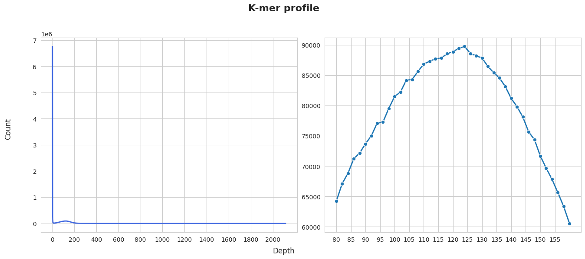

# authors:
Seraph Dobrovolskii
Ivan Mikhniuk

original here:
https://github.com/MPHRS/Genomic-data-analysis/blob/main/Project_3_E_coli_outbreak_investigation/Report.md

# **Abstract**
A hemolytic uremic syndrome (HUS) outbreak caused by a novel _Escherichia coli_ strain was investigated using _de novo_ assembly in this study. Analysis revealed the presence of _stxA_ and _stxB_ genes encoding Shiga toxin, integrated alongside genes associated with prophages, indicating horizontal gene transfer. The strain exhibited resistance to β-lactam antibiotics due to _blaCTX-M-15_ and _blaTEM-1B_ genes associated with transposons. Assembly with paired-end and mate-pair  libraries improved N50  (842,010 bp vs. 42,716 bp). One of the contigs carrying virulence/resistance genes (NODE_10_length_86688_cov_74.209320) showed 98.85% identity to the pathogenic _Escherichia coli_ W plasmid pRK1, suggesting these genes (including _blaCTX-M-15_ and _blaTEM-1B_) may be plasmid-borne, as they also showed 98.27% similarity with the virulent _Shingella sonnei_ P9 plasmid. These findings highlight the role of mobile genetic elements in pathogen evolution.
# **Introduction**

Hemolytic uremic syndrome (HUS) is a life-threatening condition characterized by kidney failure, hemolytic anemia, and thrombocytopenia, nowadays most commonly caused by Shiga toxin-producing _Escherichia coli_ (STEC) strains[1]. While E. coli typically exists as a harmless gut commensal, certain strains acquire virulence factors like Shiga toxins (encoded by _stxA_ and _stxB_ genes) through horizontal gene may transfer charring by bacteriophages or plasmids. This transformation process, exemplified by the integration of Shiga toxin-encoding prophages into the bacterial genome, converts non-pathogenic E. coli into dangerous STEC variants capable of damaging endothelial cells and causing systemic complications. Understanding these genetic mechanisms is crucial for tracking pathogenic transformations and developing interventions, especially as certain populations like young children remain particularly vulnerable to STEC infections and current treatment options remain limited to supportive care[2].

The rise of multidrug-resistant (MDR) _E. coli_ further complicates clinical management of infections. Resistance genes, such as those encoding extended-spectrum β-lactamases (ESBLs) like CTX-M-15, are often carried on mobile genetic elements (plasmids, transposons), enabling rapid circulation across bacterial populations. Traditional methods like reference-based genome alignment may fail to detect novel resistance or virulence loci, particularly in highly recombinant strains. _De novo_ genome assembly( without comparing on existing references) capturing unique genomic regions and mobile elements critical for understanding pathogen evolution. This methodology proves critical for analyzing outbreaks triggered by newly identified pathogen variants with novel genomic configurations[3].

In this study, we characterize a novel _E. coli_ strain linked to an HUS outbreak using _de novo_ assembly sequencing data. 
# **Methods**

Genomic data were obtained from public repositories, including reference sequences (NCBI accession: NC_011748). The data also included forward and reverse reads from paired-end sequencing with an insert size of 470 bp, as well as forward and reverse reads from mate-pair sequencing with insert sizes of 2 kb and 6 kb, respectively.  These files were manually downloaded. Initial quality control was performed using FastQC(v0.12.1). The genome assembly was performed using SPAdes (v3.15.5) The k-mer count was performed using the jellyfish count command with a k-mer length of 31 in a strand-independent mode (-C, considering complementarity). The quality of the assembly was assessed with QUAST (v5.3.0).

The genome was annotated using Prokka (v1.14.6) with the parameters --compliant to make name shorter for compatibility with Mauve, --kingdom Bacteria, --genus _Escherichia_. rRNA prediction was performed with Barrnap (v0.9).

16S rRNA genes were identified using BLASTn against the RefSeq database for _Escherichia coli_, using the PDAT temporal filter (1900/01/01:2011/01/01). Sequence comparison was performed using Mauve(v.2.3.1) To search for genes responsible for antibiotic resistance, we will use ResFinder(v.).

# **Results**

Based on the analysis of the K-mer profile (see Figure 1), a K-mer peak of 124 was identified, leading to an estimated genome size of 5,321,947.74 bp and an approximate sequencing depth of 186.

Figure 1 – K-mer Profile Comparison

  

For comparison, assemblies were performed separately on the paired-end library with an insert size of 470 base pairs and on a dataset combining the paired-end library with two mate-pair libraries with insert sizes of 2 kilobases and 6 kilobases.

Table 1 – Comparison of Paired-end vs. Paired-end + Mate-pair Libraries

|                                 |                        |                                      |
| ------------------------------- | ---------------------- | ------------------------------------ |
| Metric                          | Paired-end (1 library) | Paired-end + Mate-pair (3 libraries) |
| number of contigs/scaffolds     | 1407                   | 1293                                 |
| total length                    | 5176112                | 5481912                              |
| GC content (%)                  | 50.5                   | 50.53                                |
| Largest contig (bp)             | 203848                 | 1045348                              |
| N50 (bp)                        | 42716                  | 842010                               |
| L50 (count)                     | 33                     | 3                                    |
| Average Unique Length (aUN, bp) | 59156.2                | 699798.0                             |

A 16S rRNA sequence (length: 1,537 bp) was identified, showing the highest similarity to _Escherichia coli_ 55989(100%). As a result, its genome was used as a reference for further analysis.

Genome annotation and alignment to the reference genome revealed the presence of two genes (_stxA_, _stxB_) absent in the reference genome. These genes are known to be virulence factors. Additionally, genes _Bla1_ and _Bla2_, associated with β-lactam antibiotic resistance, were identified.

Table 2 – Comparison of Paired-end vs. Paired-end + Mate-pair Libraries

|   |   |
|---|---|
|Gene|Coordinates (bp)|
|_stxA_|5,375,265 – 5,376,224|
|_stxB_|5,376,236 – 5,376,505|
|_Bla1_|5,172,807 – 5,173,667|
|_Bla2_|5,176,489 – 5,177,364|

Genes associated with a phage were identified near _stxA_ and _stxB_, while transposases were found in close proximity to _Bla1_ and _Bla2_. Further analysis revealed that one of the contigs(NODE_10_length_86688_cov_74.209320) is 98.85% identical to the _Escherichia coli_ W pRK1 and 98.27% similarity with the virulent _Shingella sonnei_ P9 plasmid.

Resistance phenotypes were compared between _Escherichia coli_ 55989 and another strain (_Escherichia coli_ X). Here, "+" indicates resistance, and "-" indicates susceptibility. The identified _Escherichia coli_ strain exhibits broad-spectrum resistance, particularly to beta-lactam antibiotics.

Table 3 – Antibiotic Resistance Predictions

|   |   |   |   |
|---|---|---|---|
|Antibiotic|Class|WGS-predicted phenotype (_Escherichia coli_ 5598)|(_Escherichia coli_ X)|
|tetracycline|tetracycline|+|+|
|doxycycline|tetracycline|+|+|
|minocycline|tetracycline|-|+|
|amoxicillin|beta-lactam|+|-|
|ampicillin|beta-lactam|+|-|
|aztreonam|beta-lactam|+|-|
|cefepime|beta-lactam|+|-|
|cefotaxime|beta-lactam|+|-|
|ceftazidime|beta-lactam|+|-|
|ceftriaxone|beta-lactam|+|-|
|cephalothin|beta-lactam|+|-|
|piperacillin|beta-lactam|+|-
|ticarcillin|beta-lactam|+|-||
|ciprofloxacin|quinolone|+|-|
|nalidixic acid|quinolone|+|-|
|streptomycin|aminoglycoside|+|-|
|sulfamethoxazole|folate pathway antagonist|+|-|
|trimethoprim|folate pathway antagonist|+|-|

  
# **Discussion**

The pathogenic transformation of _E. coli_ X may occured as a result of the obtaining of critical virulence factors and mobile genetic elements that confer antibiotic resistance. The presence of _stxA_ and _stxB_ genes, which encode Shiga toxins, distinguishes this strain from the reference _E. coli_ 55989. These virulence genes are often associated with severe gastrointestinal and systemic infections. Their proximity to sequences related to phages suggests horizontal transfer through the integration of bacteriophages, which is a well-documented mechanism for the spread of toxin genes in pathogenic _E. coli_. Also that fact can beapproved by that the blast of node_10 with _stxA_ and _stxB_ genes show 98.27% identity with _Shingella sonnei_ plasmid. This genetic acquisition probably allowed _E. coli_ X to move from a commensal state to a pathogenic one capable of causing diseases in humans[4].

The strain’s resistance to β-lactam antibiotics arises from two acquired β-lactamase genes: _blaCTX-M-15_ (encoding an extended-spectrum β-lactamase) and _blaTEM-1B_ (a narrow-spectrum β-lactamase). These genes are located on a plasmid-derived contig (NODE_10). The analysis reveals that E. coli X has acquired antibiotic resistance through mobile genetic elements.  Furthermore, the strain possesses other resistance determinants (_tetA_, _sul1_/_sul2_, _dfrA7_, and aph genes) that mediate resistance to tetracyclines, sulfonamides, trimethoprim, and streptomycin, respectively. Given this multidrug-resistant profile, treatment should avoid all aforementioned antibiotic classes and instead utilize alternative agents from unaffected drug categories, selected based on susceptibility testing.

# **Supplementary materials**

K-mer profile before and after correction using SPAdes

# References

1. Bruyand M, Mariani-Kurkdjian P, Gouali M, de Valk H, King LA, Le Hello S, Bonacorsi S, Loirat C. Hemolytic uremic syndrome due to Shiga toxin-producing Escherichia coli infection. Med Mal Infect. 2018 May;48(3):167-174. doi: 10.1016/j.medmal.2017.09.012. Epub 2017 Oct 18. PMID: 29054297.
2. Gould, L. Hannah, et al. "Hemolytic uremic syndrome and death in persons with Escherichia coli O157: H7 infection, foodborne diseases active surveillance network sites, 2000–2006." Clinical Infectious Diseases 49.10 (2009): 1480-1485.
3. Sohn JI, Nam JW. The present and future of de novo whole-genome assembly. Brief Bioinform. 2018 Jan 1;19(1):23-40. doi: 10.1093/bib/bbw096. PMID: 27742661.
4. Yang F, Yang J, Zhang X, Chen L, Jiang Y, Yan Y, Tang X, Wang J, Xiong Z, Dong J, Xue Y, Zhu Y, Xu X, Sun L, Chen S, Nie H, Peng J, Xu J, Wang Y, Yuan Z, Wen Y, Yao Z, Shen Y, Qiang B, Hou Y, Yu J, Jin Q. Genome dynamics and diversity of Shigella species, the etiologic agents of bacillary dysentery. Nucleic Acids Res. 2005 Nov 7;33(19):6445-58. doi: 10.1093/nar/gki954. PMID: 16275786; PMCID: PMC1278947.

