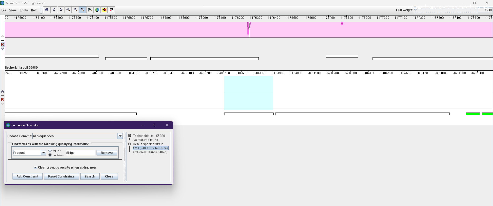
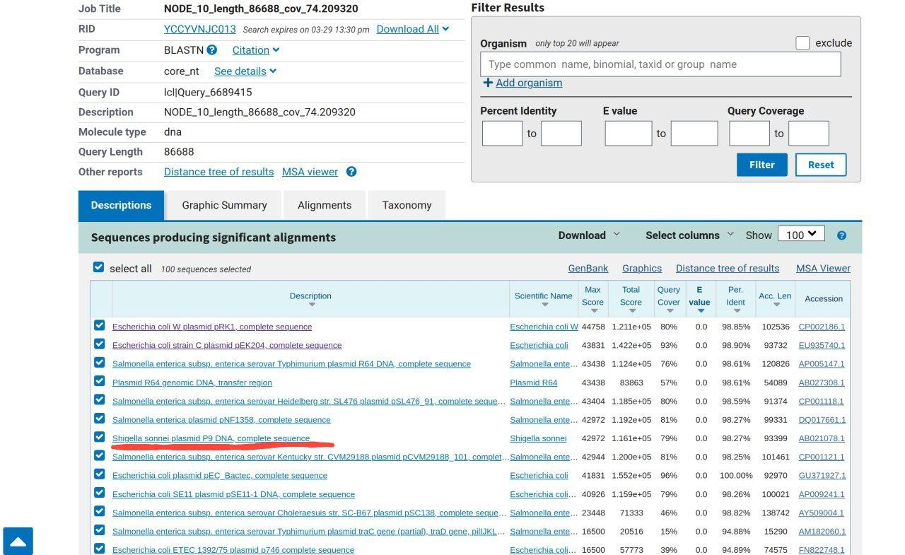

> Our workflow will be to answer the following questions:
> 
> 1. What is the genome sequence of E. coli X?
>     
> 2. What strain of E. coli is E. coli X most similar to? (Where did it come from?)
>     
> 3. What are the genes that E. coli X contains?
>     
> 4. Which of these genes make E. coli X distinct?
>     
> 5. How did E. coli X evolve to obtain these genes?
>     
> 
> How did E. coli X become pathogenic?


# **Exploring the dataset**

downloading data with  `prefetch`

```{Bash}
(GP_data) mhprs@Seraph:~/PISH/Genomics/project_3_coli/data/raw$ tree
.
├── SRR292678
│   └── SRR292678.sra
├── SRR292770
│   └── SRR292770.sra
└── SRR292862
    └── SRR292862.sra

3 directories, 3 files
```

let's unzip files

```{Bash}
find . -name "*.sra" -exec sh -c 'fastq-dump --split-files --gzip --outdir $(dirname {})/ {} && rm {}' \;
```
### Explanation:

1. **`find . -name "*.sra"`**
    
    - Searches recursively in the current directory (`.`) for all files ending with `.sra`.
        
2. **`-exec sh -c '...' \;`**
    
    - Executes the enclosed command (`sh -c '...'`) for each `.sra` file found.
        
    - `\;` marks the end of the `-exec` command.
        
3. **`fastq-dump` Command Breakdown**:
    
    - **`--split-files`**:  
        Splits the output into paired-end files (`_1.fastq.gz` and `_2.fastq.gz`) if the data is paired-end. For single-end data, only one file is created.
        
    - **`--gzip`**:  
        Compresses the output FASTQ files using gzip (saves space).
        
    - **`--outdir $(dirname {})/`**:
        
        - `{}` is replaced by the path of the current `.sra` file (e.g., `./SRR292678/SRR292678.sra`).
            
        - `$(dirname {})` extracts the directory path (e.g., `./SRR292678`).
            
        - Outputs files to the same directory as the input `.sra` file.
            
    - **`{}`**:  
        The path to the current `.sra` file being processed.
        
4. **`&& rm {}`**
    
    - Deletes the original `.sra` file (`{}`) **only** if `fastq-dump` succeeds (thanks to `&&`).
## Fastqc with all'SRR'
```{Bash}
for dir in SRR*/; do
    # Construct paths to forward (R1) and reverse (R2) read files
    r1="${dir}${dir%/}_1.fastq.gz"  # Forward reads (R1)
    r2="${dir}${dir%/}_2.fastq.gz"  # Reverse reads (R2)
    
    # Print progress message
    echo "Processing $r1 and $r2"
    
    # Run FastQC on both files, save results to ./fastqc_results/
    fastqc "$r1" "$r2" -o ./fastqc_results/
    
    # Alternative: Alignment with BWA (commented out)
    # bwa mem reference.fa "$r1" "$r2" > "${dir}output.sam"
done
```


---

### Key Explanations:

1. **`for dir in SRR*/; do`**
    
    - Iterates through all directories whose names start with `SRR` (e.g., `SRR292678/`).
        
2. **`r1="${dir}${dir%/}_1.fastq.gz"`**
    
    - Constructs the path to the **forward reads (R1)** file:
        
        - `${dir}` → Directory name (e.g., `SRR292678/`).
            
        - `${dir%/}` → Removes the trailing `/` (e.g., `SRR292678`).
            
        - Combines to form `SRR292678/SRR292678_1.fastq.gz`.
            
3. **`r2=...`**
    
    - Same logic as above, but for **reverse reads (R2)** (e.g., `_2.fastq.gz`).
        
4. **`fastqc "$r1" "$r2" -o ./fastqc_results/`**
    
    - Runs FastQC on both R1 and R2 files.
        
    - `-o ./fastqc_results/` saves reports to this directory (created automatically if missing).

### Consolidated FastQC Report Summary

|Filename|File Type|Encoding|Total Sequences|Total Bases|Poor Quality|Seq Length|%GC|
|---|---|---|---|---|---|---|---|
|SRR292678_1.fastq.gz|Conventional base calls|Sanger / Illumina 1.9|6,111,112|550 Mbp|0|90|49|
|SRR292678_2.fastq.gz|Conventional base calls|Sanger / Illumina 1.9|6,111,112|550 Mbp|0|90|49|
|SRR292770_1.fastq.gz|Conventional base calls|Sanger / Illumina 1.9|5,102,041|250 Mbp|0|49|50|
|SRR292770_2.fastq.gz|Conventional base calls|Sanger / Illumina 1.9|5,102,041|250 Mbp|0|49|49|
|SRR292862_1.fastq.gz|Conventional base calls|Sanger / Illumina 1.9|5,102,041|250 Mbp|0|49|50|
|SRR292862_2.fastq.gz|Conventional base calls|Sanger / Illumina 1.9|5,102,041|250 Mbp|0|49|49|

### Key Observations:

1. **Consistent Quality**: All samples show 0 sequences flagged as poor quality.
    
2. **Paired-End Matching**:
    
    - SRR292678 has longer reads (90 bp) compared to others (49 bp)
        
    - All pairs have identical sequence counts (proper pairing)
        
3. **GC Content**: Stable around 49-50% (typical for E. coli)


# **2. (optional, 1 extra credit). K-mer profile and genome size estimation**

# **3. Assembling E. coli X genome from paired reads**


```{Bash}
spades.py   -1 raw/SRR292678/SRR292678_1.fastq.gz   -2 raw/SRR292678/SRR292678_2.fastq.gz   -o processed/SRR292678_assembly
```

======= SPAdes pipeline finished WITH WARNINGS!

=== Error correction and assembling warnings:
 * 0:05:38.551    88M / 3192M WARN    General                 (launcher.cpp              : 180)   Your data seems to have high uniform coverage depth. It is strongly recommended to use --isolate option.
```
(GP_assemby) mhprs@Seraph:~/PISH/Genomics/project_3_coli/data$ tree
.
├── processed
│   └── SRR292678_assembly
│       ├── K21
│       │   ├── configs
│       │   │   ├── careful_mda_mode.info
│       │   │   ├── careful_mode.info
│       │   │   ├── config.info
│       │   │   ├── construction.info
│       │   │   ├── detail_info_printer.info
│       │   │   ├── distance_estimation.info
│       │   │   ├── hmm_mode.info
│       │   │   ├── isolate_mode.info
│       │   │   ├── large_genome_mode.info
│       │   │   ├── mda_mode.info
│       │   │   ├── meta_mode.info
│       │   │   ├── metaplasmid_mode.info
│       │   │   ├── metaviral_mode.info
│       │   │   ├── pe_params.info
│       │   │   ├── plasmid_mode.info
│       │   │   ├── rna_mode.info
│       │   │   ├── rnaviral_mode.info
│       │   │   ├── sewage_mode.info
│       │   │   ├── simplification.info
│       │   │   └── toy.info
│       │   ├── final.lib_data
│       │   └── simplified_contigs
│       │       ├── contigs.off
│       │       ├── contigs.seq
│       │       └── contigs_info
│       ├── K33
│       │   ├── configs
│       │   │   ├── careful_mda_mode.info
│       │   │   ├── careful_mode.info
│       │   │   ├── config.info
│       │   │   ├── construction.info
│       │   │   ├── detail_info_printer.info
│       │   │   ├── distance_estimation.info
│       │   │   ├── hmm_mode.info
│       │   │   ├── isolate_mode.info
│       │   │   ├── large_genome_mode.info
│       │   │   ├── mda_mode.info
│       │   │   ├── meta_mode.info
│       │   │   ├── metaplasmid_mode.info
│       │   │   ├── metaviral_mode.info
│       │   │   ├── pe_params.info
│       │   │   ├── plasmid_mode.info
│       │   │   ├── rna_mode.info
│       │   │   ├── rnaviral_mode.info
│       │   │   ├── sewage_mode.info
│       │   │   ├── simplification.info
│       │   │   └── toy.info
│       │   ├── final.lib_data
│       │   └── simplified_contigs
│       │       ├── contigs.off
│       │       ├── contigs.seq
│       │       └── contigs_info
│       ├── K55
│       │   ├── assembly_graph.fastg
│       │   ├── assembly_graph_after_simplification.gfa
│       │   ├── assembly_graph_with_scaffolds.gfa
│       │   ├── before_rr.fasta
│       │   ├── configs
│       │   │   ├── careful_mda_mode.info
│       │   │   ├── careful_mode.info
│       │   │   ├── config.info
│       │   │   ├── construction.info
│       │   │   ├── detail_info_printer.info
│       │   │   ├── distance_estimation.info
│       │   │   ├── hmm_mode.info
│       │   │   ├── isolate_mode.info
│       │   │   ├── large_genome_mode.info
│       │   │   ├── mda_mode.info
│       │   │   ├── meta_mode.info
│       │   │   ├── metaplasmid_mode.info
│       │   │   ├── metaviral_mode.info
│       │   │   ├── pe_params.info
│       │   │   ├── plasmid_mode.info
│       │   │   ├── rna_mode.info
│       │   │   ├── rnaviral_mode.info
│       │   │   ├── sewage_mode.info
│       │   │   ├── simplification.info
│       │   │   └── toy.info
│       │   ├── final.lib_data
│       │   ├── final_contigs.fasta
│       │   ├── final_contigs.paths
│       │   ├── path_extend
│       │   ├── scaffolds.fasta
│       │   └── scaffolds.paths
│       ├── assembly_graph.fastg
│       ├── assembly_graph_after_simplification.gfa
│       ├── assembly_graph_with_scaffolds.gfa
│       ├── before_rr.fasta
│       ├── contigs.fasta
│       ├── contigs.paths
│       ├── corrected
│       │   ├── SRR292678_1.fastq00.0_0.cor.fastq.gz
│       │   ├── SRR292678_2.fastq00.0_0.cor.fastq.gz
│       │   ├── SRR292678__unpaired00.0_0.cor.fastq.gz
│       │   ├── configs
│       │   │   └── config.info
│       │   └── corrected.yaml
│       ├── dataset.info
│       ├── input_dataset.yaml
│       ├── misc
│       │   └── broken_scaffolds.fasta
│       ├── params.txt
│       ├── pipeline_state
│       │   ├── stage_0_before_start
│       │   ├── stage_10_as_finish
│       │   ├── stage_11_bs
│       │   ├── stage_12_terminate
│       │   ├── stage_1_ec_start
│       │   ├── stage_2_ec_runtool
│       │   ├── stage_3_ec_compress
│       │   ├── stage_4_ec_finish
│       │   ├── stage_5_as_start
│       │   ├── stage_6_k21
│       │   ├── stage_7_k33
│       │   ├── stage_8_k55
│       │   └── stage_9_copy_files
│       ├── run_spades.sh
│       ├── run_spades.yaml
│       ├── scaffolds.fasta
│       ├── scaffolds.paths
│       ├── spades.log
│       ├── tmp
│       └── warnings.log
└── raw
    ├── SRR292678
    │   ├── SRR292678_1.fastq.gz
    │   └── SRR292678_2.fastq.gz
    ├── SRR292770
    │   ├── SRR292770_1.fastq.gz
    │   └── SRR292770_2.fastq.gz
    ├── SRR292862
    │   ├── SRR292862_1.fastq.gz
    │   └── SRR292862_2.fastq.gz
    └── fastqc_results
        ├── SRR292678_1_fastqc.html
        ├── SRR292678_1_fastqc.zip
        ├── SRR292678_2_fastqc.html
        ├── SRR292678_2_fastqc.zip
        ├── SRR292770_1_fastqc.html
        ├── SRR292770_1_fastqc.zip
        ├── SRR292770_2_fastqc.html
        ├── SRR292770_2_fastqc.zip
        ├── SRR292862_1_fastqc.html
        ├── SRR292862_1_fastqc.zip
        ├── SRR292862_2_fastqc.html
        └── SRR292862_2_fastqc.zip

21 directories, 129 files
```
## quast
```{Bash}
quast.py processed/SRR292678_assembly/contigs.fasta -o quast_report
```


```
(GP_assemby) mhprs@Seraph:~/PISH/Genomics/project_3_coli/data$ cat quast_report/report.txt
All statistics are based on contigs of size >= 500 bp, unless otherwise noted (e.g., "# contigs (>= 0 bp)" and "Total length (>= 0 bp)" include all contigs).

Assembly                    contigs
# contigs (>= 0 bp)         508
# contigs (>= 1000 bp)      147
# contigs (>= 5000 bp)      81
# contigs (>= 10000 bp)     68
# contigs (>= 25000 bp)     50
# contigs (>= 50000 bp)     33
Total length (>= 0 bp)      5316502
Total length (>= 1000 bp)   5207956
Total length (>= 5000 bp)   5043435
Total length (>= 10000 bp)  4953151
Total length (>= 25000 bp)  4664627
Total length (>= 50000 bp)  4027515
# contigs                   201
Largest contig              300784
Total length                5246794
GC (%)                      50.53
N50                         105346
N90                         21421
auN                         128520.2
L50                         15
L90                         53
# N's per 100 kbp           0.00
```


# **3a (Optional, 1 extra credit). Effect of read correction.**

# **4. Impact of reads with large insert size**

```{Bash}
spades.py \
  -1 raw/SRR292678/SRR292678_1.fastq.gz \
  -2 raw/SRR292678/SRR292678_2.fastq.gz \
  --mp1-1 raw/SRR292770/SRR292770_1.fastq.gz \
  --mp1-2 raw/SRR292770/SRR292770_2.fastq.gz \
  --mp2-1 raw/SRR292862/SRR292862_1.fastq.gz \
  --mp2-2 raw/SRR292862/SRR292862_2.fastq.gz \
  -o processed/combined_assembly
```


have exceed memory limit
so download preassembled 
```
(GP_assemby) mhprs@Seraph:~/PISH/Genomics/project_3_coli/data$ cat quast_report_three/report.txt
All statistics are based on contigs of size >= 500 bp, unless otherwise noted (e.g., "# contigs (>= 0 bp)" and "Total length (>= 0 bp)" include all contigs).

Assembly                    contigs
# contigs (>= 0 bp)         369
# contigs (>= 1000 bp)      79
# contigs (>= 5000 bp)      33
# contigs (>= 10000 bp)     30
# contigs (>= 25000 bp)     26
# contigs (>= 50000 bp)     22
Total length (>= 0 bp)      5403327
Total length (>= 1000 bp)   5331230
Total length (>= 5000 bp)   5202939
Total length (>= 10000 bp)  5183802
Total length (>= 25000 bp)  5133691
Total length (>= 50000 bp)  4975501
# contigs                   105
Largest contig              698474
Total length                5350156
GC (%)                      50.59
N50                         335515
N90                         79998
auN                         319603.4
L50                         6
L90                         20
# N's per 100 kbp           0.00
```


```
(GP_assemby) mhprs@Seraph:~/PISH/Genomics/project_3_coli/data$ cat quast_report_three_scaffolds/report.txt
All statistics are based on contigs of size >= 500 bp, unless otherwise noted (e.g., "# contigs (>= 0 bp)" and "Total length (>= 0 bp)" include all contigs).

Assembly                    scaffolds
# contigs (>= 0 bp)         327
# contigs (>= 1000 bp)      54
# contigs (>= 5000 bp)      16
# contigs (>= 10000 bp)     13
# contigs (>= 25000 bp)     10
# contigs (>= 50000 bp)     10
Total length (>= 0 bp)      5437160
Total length (>= 1000 bp)   5365719
Total length (>= 5000 bp)   5258076
Total length (>= 10000 bp)  5238939
Total length (>= 25000 bp)  5200270
Total length (>= 50000 bp)  5200270
# contigs                   90
Largest contig              2815616
Total length                5391554
GC (%)                      50.57
N50                         2815616
N90                         180369
auN                         1633387.0
L50                         1
L90                         7
# N's per 100 kbp           627.52

```


https://www.biostars.org/p/385150/


# **5. Genome Annotation**
```{Bash}

prokka   --outdir processed/prokka_annotation   --prefix E_coli   processed/combined_assembly/three_libs_spades_out/scaffolds.fasta --force --centre X --compliant
```

--centre X --compliant - due to the fact that out NODE names are too long

```
(GP_assemby) mhprs@Seraph:~/PISH/Genomics/project_3_coli/data/processed$ ls prokka_annotation/
E_coli.err  E_coli.ffn  E_coli.fsa  E_coli.gff  E_coli.sqn  E_coli.tsv
E_coli.faa  E_coli.fna  E_coli.gbk  E_coli.log  E_coli.tbl  E_coli.txt
```
# **6. Finding the closest relative of E. coli X**

```{Bash}
barrnap combined_assembly/three_libs_spades_out/scaffolds.fasta
[barrnap] This is barrnap 0.9
```

output
```
[barrnap] Found: 16S_rRNA NODE_1_length_2815616_cov_74.3819_ID_564387 L=1538/1585 326359..327896 - 16S ribosomal RNA
[barrnap] Found: 16S_rRNA NODE_1_length_2815616_cov_74.3819_ID_564387 L=1538/1585 595966..597503 - 16S ribosomal RNA
[barrnap] Found: 16S_rRNA NODE_1_length_2815616_cov_74.3819_ID_564387 L=1538/1585 2504403..2505940 - 16S ribosomal RNA
[barrnap] Found: 16S_rRNA NODE_5_length_236041_cov_85.7779_ID_563492 L=1538/1585 43835..45372 + 16S ribosomal RNA
[barrnap] Found: 16S_rRNA NODE_5_length_236041_cov_85.7779_ID_563492 L=1538/1585 85462..86999 + 16S ribosomal RNA
[barrnap] Found: 16S_rRNA NODE_6_length_209194_cov_80.6603_ID_563563 L=1538/1585 111955..113492 + 16S ribosomal RNA
```

now run with output file
```
barrnap combined_assembly/three_libs_spades_out/scaffolds.fasta --outseq output_rrna.fasta

```

filter 16S sequnces

```{Bash}
seqkit grep -r -p "16S" output_rrna.fasta > 16S.fasta
```

now use BLAST with this file of 16S seqeunces


Your search is limited to records that include: Escherichia coli (taxid:562), and entrez query: 1900/01/01:2011/01/01[PDAT]


result here


https://blast.ncbi.nlm.nih.gov/Blast.cgi?CMD=Get&VIEW_RESULTS=FromRes&RID=YBD2BF21013&UNIQ_OBJ_NAME=A_SearchResults_1txtnQ_18Sb_dgYJyjTs8Lf_GTJ71_1oPJ7Q&QUERY_INDEX=0


SOURCE      Escherichia coli 55989
ACCESSION   NC_011748
VERSION     NC_011748.1


# **7. What is the genetic cause of HUS?**
 


https://www.biostars.org/p/205246/ to install mauve read this issue





# **8. Tracing the source of toxin genes in E. coli X**

Genes associated with a phage were identified near stxA and stxB, while transposases were found in close proximity to Bla1 and Bla2. ("Phage endopeptidase Rz", "Phage antirepressor protein", "Phage lysozyme R
# **9. Antibiotic resistance detection**


| Resistance gene | Identity | Alignment length/gene length | Position in reference | Contig or depth                            | Position in contig | Phenotype                                                                                                                         | PMID        | Accession no. | Notes                 |
| --------------- | -------- | ---------------------------- | --------------------- | ------------------------------------------ | ------------------ | --------------------------------------------------------------------------------------------------------------------------------- | ----------- | ------------- | --------------------- |
| aph(6)-Id       | 100.00%  | 837 /                        | 1...837               | NODE_23_length_4495_cov_39.7392_ID_565568  | 3597...4433        | ['streptomycin']                                                                                                                  | 2653965     | M28829        | Alternative name strB |
| aph(3'')-Ib     | 100.00%  | 804 /                        | 1...804               | NODE_23_length_4495_cov_39.7392_ID_565568  | 2794...3597        | ['streptomycin']                                                                                                                  | 12029529    | AF321551      | Alternative name strA |
| blaCTX-M-15     | 100.00%  | 876 /                        | 1...876               | NODE_10_length_79998_cov_77.5182_ID_563850 | 75294...76169      | ['amoxicillin', 'ampicillin', 'cefepime', 'cefotaxime', 'ceftazidime', 'piperacillin', 'aztreonam', 'ticarcillin', 'ceftriaxone'] | 11470367    | AY044436      | Class A               |
| blaTEM-1B       | 100.00%  | 861 /                        | 1...861               | NODE_10_length_79998_cov_77.5182_ID_563850 | 78991...79851      | ['amoxicillin', 'ampicillin', 'piperacillin', 'ticarcillin', 'cephalothin']                                                       | 15388431    | AY458016      | Class A               |
| sul2            | 100.00%  | 816 /                        | 1...816               | NODE_23_length_4495_cov_39.7392_ID_565568  | 1918...2733        | ['sulfamethoxazole']                                                                                                              | 22888274    | HQ840942      |                       |
| sul1            | 100.00%  | 761 /                        | 1...761               | NODE_24_length_4418_cov_55.8329_ID_565590  | 3604...4364        | ['sulfamethoxazole']                                                                                                              | 16339607    | AY522923      |                       |
| sul1            | 100.00%  | 761 /                        | 1...761               | NODE_24_length_4418_cov_55.8329_ID_565590  | 3604...4364        | ['sulfamethoxazole']                                                                                                              | 18753343    | AY115475      |                       |
| sul1            | 100.00%  | 761 /                        | 1...761               | NODE_24_length_4418_cov_55.8329_ID_565590  | 3604...4364        | ['sulfamethoxazole']                                                                                                              | 17158944    | DQ914960      |                       |
| sul1            | 100.00%  | 761 /                        | 1...761               | NODE_24_length_4418_cov_55.8329_ID_565590  | 3604...4364        | ['sulfamethoxazole']                                                                                                              | unpublished | U12338        |                       |
| tet(A)          | 100.00%  | 1200 /                       | 1...1200              | NODE_26_length_4054_cov_26.5056_ID_565642  | 956...2155         | ['tetracycline', 'doxycycline']                                                                                                   | 12654659    | AJ517790      |                       |
| dfrA7           | 100.00%  | 474 /                        | 1...474               | NODE_24_length_4418_cov_55.8329_ID_565590  | 2560...3033        | ['trimethoprim']                                                                                                                  | unpublished | AB161450      |                       |

# **10. Antibiotic resistance mechanism**



# **11. Conclusion**
